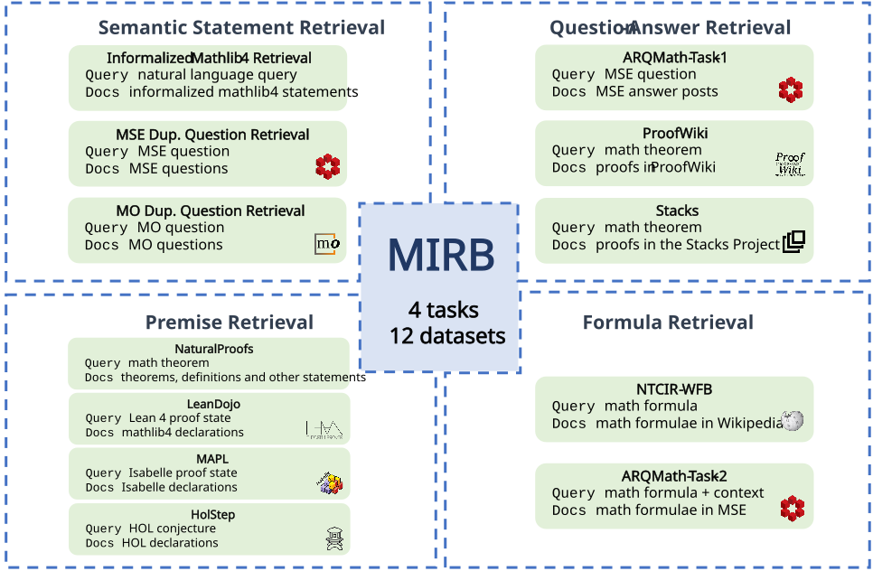

# MIRB: Mathematical Information Retrieval Benchmark



[**MIRB**](https://arxiv.org/abs/2505.15585) (**M**athematical **I**nformation **R**etrieval **B**enchmark) is a benchmark designed to evaluate the performance of retrieval models on mathematical information retrieval tasks. The dataset is available at HuggingFace [MIRB](https://huggingface.co/collections/hcju/mirb-6827001711765454f58c5a76).

> **Note**: This project is a fork of [MTEB(1.28.0)](https://github.com/embeddings-benchmark/mteb/tree/1.28.0) with modifications to handle dynamic corpus. We thank the original authors for their work.

## Installation

```bash
git clone https://github.com/j991222/mirb.git
cd mirb
pip install -e .
```

## Example Usage


* Evaluate on the whole benchmark:
```bash
cd tests/test_mirb
python test_mirb.py
```


* Evaluate on one task:

```python
import mteb

model_name = "intfloat/e5-mistral-7b-instruct"
task_name = "MODupRetrieval"
tasks = mteb.get_tasks(tasks=[task_name])
evaluation = mteb.MTEB(tasks=tasks)

results = evaluation.run(model, output_folder=f"results/mirb/{model_name}/{task_name}", encode_kwargs={"batch_size": 16, "max_length": 4096}, save_predictions=True)

```
## Citing
If you find this repository helpful, feel free to cite [MIRB: Mathematical Information Retrieval Benchmark](https://arxiv.org/abs/2505.15585)

```
@article{ju2025mirb,
        title={MIRB: Mathematical Information Retrieval Benchmark},
        author={Ju, Haocheng and Dong, Bin},
        journal={arXiv preprint arXiv:2505.15585},
        year={2025}
        }
```